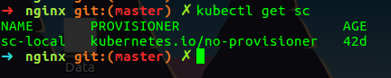
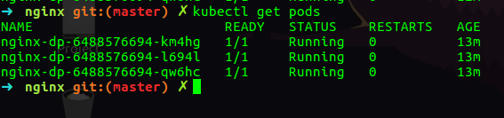
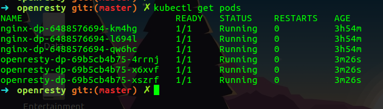
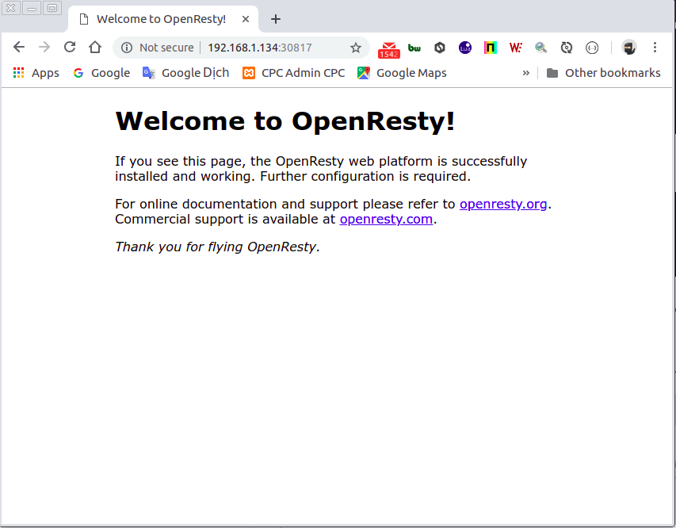

# Project Cài Đặt Các Service Bằng Kubernetes
Cài đặt các service bằng kubernetes phục vụ cho các server test, dev, staging và các môi trường lab thử nghiệm


## Chuẩn Bị
* 1 máy master và ít nhất 1 node (worker)
* Các máy đã cài đặt sẵn docker và kubernetes
* Các máy đã cấu hình k8s cluster

> ###  Recommend
>
> * Đối với các Service có file *-pv.yaml và *-pvc.yaml nên tạo pv trước rồi mới tạo pvc để pvc có thể bound được với pv tương ứng
> * Deploy service nào thì tạo pv đó. Tránh deploy hết các pv cùng một lần sẽ xảy ra trường hợp pvc của service này bound nhầm service khác 

# Cài Đặt
Cài đặt theo từng bước giúp bạn hiểu cách cài đặt và vận hành của k8s


## Storage Classes

Tạo Storage Classes để các service có một namespaces store classes tự tạo folder khi folder chưa có trên Node

```
cd store-class/
kubectl create -f sc.yaml
```





## Nginx

Folder Nginx

```
.
├── conf
│   ├── conf.d
│   │   ├── ...
│   ├── fastcgi_params
│   └── koi-utf
│   └── ...
├── html
│   ├── 50x.yaml
│   └── index.yaml
├── deploy
│   ├── nginx-dp.yaml
│   └── nginx-pv.yaml
│   ├── nginx-pvc.yaml
│   └── nginx-svc.yaml
├── nginx-dp.yaml
├── nginx-pv.yaml
├── nginx-pvc.yaml
├── nginx-svc.yaml

```
* conf - Chứa config của nginx
* deploy -  Chứa file deploy nginx kubernetes lên server (khác đường dẫn mount volume)
* nginx-dp.yaml - Deploy nginx service theo [Deployment Controller](https://kubernetes.io/docs/concepts/workloads/controllers/deployment/)
* nginx-pv.yaml - Tạo [Persistent Volume](https://kubernetes.io/docs/concepts/storage/persistent-volumes/) cho nginx
* nginx-pvc.yaml - Tạo [Persistent Volume Claims](https://kubernetes.io/docs/concepts/storage/persistent-volumes/#persistentvolumeclaims) bound Persistent Volume(PV)
* nginx-svc.yaml - Tạo [Service](https://kubernetes.io/docs/concepts/services-networking/service/) cho nginx để client kết nối được với nginx

##### Cài đặt nginx trên kubernetes

* Copy file trong thư mục ***conf*** vào đường dẫn ***/media/nginx/conf***  ở trên Node ( Đường dẫn này hostpath được định nghĩa trong file nginx-pv, có thể thay đổi được đường dẫn ).  

* Nếu thư mục ***/media/nginx/conf*** trên Node chưa có thì tạo mới.
* Đảm bảo các node đều có thư mục ***conf***

Tạo PV nginx

```
kubectl create -f nginx-pv.yaml
```

Tạo PVC nginx
```
kubectl create -f nginx-pvc.yaml
```

Tạo Service nginx

```
kubectl create -f nginx-svc.yaml
```

Deploy service nginx với image ***nginx:lastest***

```
kubectl create -f nginx-dp.yaml
```

Kiểm tra trạng thái pods 





Kiểm tra port service 


* (Optional) Copy file trong thư mục ***html*** vào đường dẫn ***/media/nginx/html*** ở trên Node 

Kiểm tra thử trên một Node bằng cách nhập http://Ip-Node:NodePort 

* NodePort - Kubernetes default tạo random trong khoảng 30000-32767. Như trong hướng dẫn trên node port là 30187

  


## Openresty

Folder Openresty

```
.
├── conf
│   └── ...
├── deploy
│   ├── openresty-dp.yaml
│   └── openresty-pv.yaml
│   ├── openresty-pvc.yaml
│   └── openresty-svc.yaml
├── nginx.conf
├── openresty-dp.yaml
├── openresty-pv.yaml
├── openresty-pvc.yaml
├── openresty-svc.yaml

```

* conf - Chứa config của openresty
* deploy -  Chứa file deploy Openresty kubernetes lên server (khác đường dẫn mount volume)
* openresty-dp.yaml - Deploy openresty service theo [Deployment Controller](https://kubernetes.io/docs/concepts/workloads/controllers/deployment/)
* openresty-pv.yaml - Tạo [Persistent Volume](https://kubernetes.io/docs/concepts/storage/persistent-volumes/) cho openresty
* openresty-pvc.yaml - Tạo [Persistent Volume Claims](https://kubernetes.io/docs/concepts/storage/persistent-volumes/#persistentvolumeclaims) bound Persistent Volume(PV)
* openresty-svc.yaml - Tạo [Service](https://kubernetes.io/docs/concepts/services-networking/service/) cho openresty để client kết nối được với openresty

##### Cài đặt nginx trên kubernetes

- Copy file ***default.conf*** vào đường dẫn ***/media/openresty/conf***  ở trên Node ( Đường dẫn này hostpath được định nghĩa trong file openresty-pv, có thể thay đổi được đường dẫn ).  

- Nếu thư mục ***/media/openresty/conf*** trên Node chưa có thì tạo mới.
- Đảm bảo các node đều có thư mục ***conf***

Tạo PV openresty

```
kubectl create -f openresty-pv.yaml
```

Tạo PVC openresty

```
kubectl create -f openresty-pvc.yaml
```

Tạo Service openresty

```
kubectl create -f openresty-svc.yaml
```

Deploy service nginx với image ***openresty:lastest***

```
kubectl create -f openresty-dp.yaml
```

Kiểm tra trạng thái pods 





Kiểm tra trạng thái port service


* (Optional) Copy file trong thư mục ***html*** vào đường dẫn ***/media/openresty/html*** ở trên Node 

Kiểm tra thử openrestry chạy trên một Node





